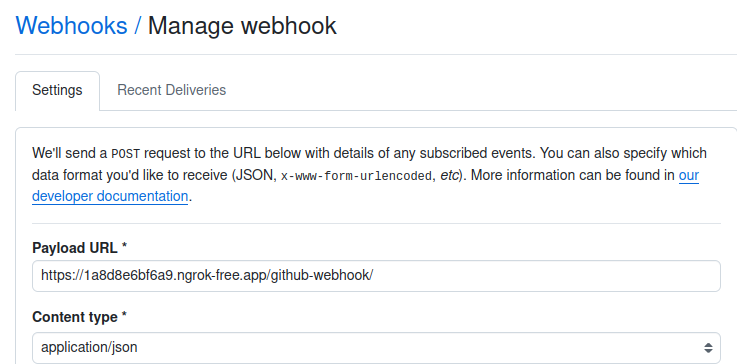
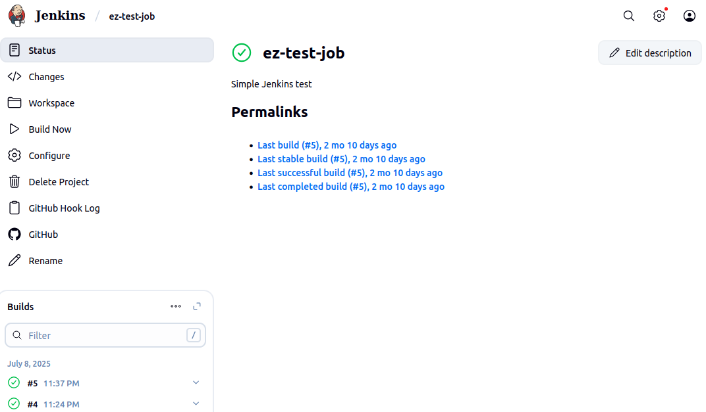

# Jenkins freestyle Project (with GitHub)

This guide demonstrates how to configure Jenkins to connect to a GitHub repository and automatically trigger builds using GitHub webhooks. This setup enables true continuous integration where code changes automatically initiate the build process.
Prerequisites

    ✅ Jenkins server installed and running

    ✅ GitHub account with a repository

    ✅ Network access between GitHub and your Jenkins server

    ✅ Basic understanding of Jenkins and GitHub

### Step 1: Install Required Plugins

1. Navigate to Manage Jenkins → Manage Plugins

2. Go to the Available tab

3. Search for and install these plugins:

    - GitHub Integration Plugin

    - GitHub API Plugin

    - Git Plugin (usually installed by default)

4. Restart Jenkins after installation

### Step 2: Creating a Freestyle Project

1. From the dashboard menu, click on `New Item`

2. Create a project with a desired name

### Step 3: Connecting Jenkins to the Source Code Management

1. Create a new GitHub repository called jenkins-scm with a README.md file.

2. In the `GitHub Project > Project url` section, paste the GitHub URL.

3. Connect Jenkins to the repository on GitHub by pasting the repository URL in the Source Code Management section of the project configuration. 

4. Specify the branch to build with in `Branch Specifier (blank for 'any')` section.

5. Under `Triggers`, tick the box `GitHub hook trigger for GITScm polling`

6. Save the configuration and click "Build Now" to connect Jenkins to your repository.

### Sep 4: Configure Public IP with Ngrok (Optional)

This is necessary if you areif you are running Jenkins on localhost.

1. Install Ngrok

    If you're on Linux, you can install Ngrok via terminal:

    ```bash
    curl -s https://ngrok-agent.s3.amazonaws.com/ngrok.asc | sudo tee /etc/apt/trusted.gpg.d/ngrok.asc >/dev/null
    echo "deb https://ngrok-agent.s3.amazonaws.com buster main" | sudo tee /etc/apt/sources.list.d/ngrok.list
    sudo apt update && sudo apt install ngrok
    ```
2. Authenticate Ngrok

    Sign up at [ngrok.com](https://ngrok.com) then copy your auth token from the dashboard and run:

    ```sh
    ngrok config add-authtoken YOUR_AUTH_TOKEN
    ```

3. Expose Jenkins to the Internet

    Run this command to start a tunnel:

    ```sh
    ngrok http 8080
    ```

    Ngrok will generate a public URL like https://randomstring.ngrok.io that forwards traffic to your local Jenkins server.

### Step 5: Create a GitHub webhook

Create a Webhook on GitHub using Jenkin's IP address and the port number:

1. On GitHub, click `settings`

2. Click `webhooks`

3. Add the jenkins' public IP address 

    

4. Add the webhook.

5. Make changes in any file and push to GitHub.

6. A new build will be launched automatically.

    

## Conclusion

You've successfully configured Jenkins to automatically build your project when changes are pushed to GitHub. This setup enables true continuous integration by:

    ✅ Automatically triggering builds on code changes

    ✅ Providing build status feedback to GitHub

    ✅ Supporting both freestyle and pipeline projects

    ✅ Enabling efficient development workflows